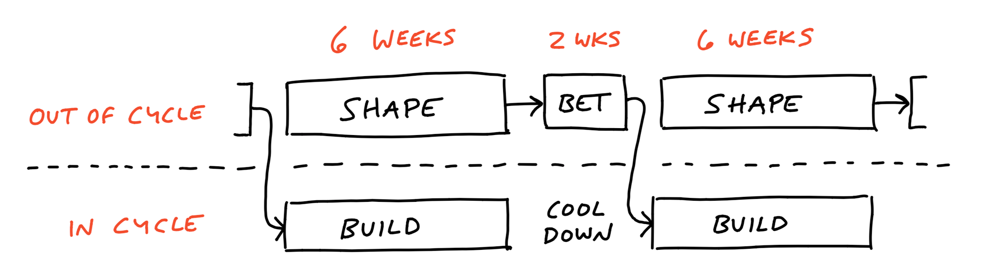

+++
title = 'The Shape Up Methodology by Basecamp'
date = 2024-12-09T12:44:36-03:00
draft = false
+++

---

> This post is part of a serie of posts about the Basecamp's Shape Up methodology. In this post, we will talk about what Shape Up is and present an overview of the process.
In the next post, we will focus on how each step works in practice. If you are a developer, product manager, or part of a technology team, this series is for you!

---

## Introduction

In general, *Shape Up* is a framework created by Basecamp that seeks to solve the common challenges faced by product development teams, especially those caused by growing pains. [Learn more about the origins and objectives of Shape Up on the official Basecamp website](https://basecamp.com/shapeup/0.3-chapter-01#growing-pains).

This methodology helps teams to better organize themselves by modeling problems in advance, allowing them to build and deliver solutions within a fixed period of time (6 weeks). This results in greater efficiency and value generation for the business. Ideal for smaller companies, Shape Up balances the need for structured processes with adaptability. It minimizes excessive scopes and ensures that teams focus on high-priority tasks.

### **Glossary of important terms:**

- `Pitch`: A problem that needs to be solved; it is the unit of work in Shape Up.
- `Triad`: Composed of a Product Manager, a Tech Lead, and a Designer; responsible for refining the *Pitches*.
- `Dev team`: Development team that executes the work.
- `Appetite`: Estimated time to solve a *Pitch*; usually 6 weeks.
- `Rabbit Hole`: Problems that arise during the execution of a *Pitch* and are out of scope.
- `Cool Down`: 2-week rest period between 6-week cycles.

---

## Why Shape Up?

1. **Balance between autonomy and responsibility**  
   Teams have the freedom to execute, but within clear and objective parameters.

2. **Focus on value delivery**
   Teams prioritize what really matters to the business.

3. **Risk reduction**
   Prior refinement minimizes uncertainties during execution.

4. **Controlled scope**
   The *Pitch* delimits the work to be done, avoiding excessive scopes.

---

## The Process

In *Shape Up*, every problem is refined in advance by the *triad* (PM+TL+PD) before entering development. The process is divided into two main groups:

1. **Out of Cycle** (*Upstream*)

2. **Within the Cycle** (*Downstream*)

---

### Out of Cycle

#### **Shape**

The *Shaping* is a refinement process carried out by the *triad* (PM+TL+PD) over 6 weeks. During this stage, the *triad* explores the problem deeply, consults experts when necessary, and documents all the context (e.g.: framing, metrics, flows, prototypes). The goal is to model the problem so that the development team can work autonomously on the solution.

> *If the refinement is well done, the execution will be more efficient. This creates a positive cycle of autonomy for both parties (virtuous cycle).*

**The reverse is also true, you already understand the logic, right?**

It is important to note that the amount of context in a Pitch can vary for various reasons: complexity of the subject (business), technical complexity, and team maturity.

> ℹ️ *The shaping stage occurs in parallel with the BUILD cycle.*

#### **Betting Table**

After *Shaping*, stakeholders gather at the "betting table" to decide which *Pitches* will be prioritized. During this meeting, the *triad* presents each *Pitch*, explaining the problem, the proposed solution, the *appetite*, and the *rabbit holes*. Stakeholders then decide which *Pitches* will enter the next BUILD cycle.

> ℹ️ *This step occurs after the 6 weeks of SHAPE.*

---

### Within the Cycle

#### **Build**

The *Build* is the 6-week cycle where the development team builds, tests, and delivers the solution to the problem. During this period, the focus is exclusively on delivery within the defined *appetite*. New problems discovered during execution are documented for treatment in future SHAPE cycles.

> ℹ️ *BUILD occurs in parallel with the SHAPE cycle.*

#### **Cool Down**

After the BUILD cycle, there is a 2-week rest period called *Cool Down*. During this time, the team should:

- Reflect on the previous cycle.
- Solve minor problems, such as technical debts.
- Review documentation and prepare for the next cycle.

> *The Cool Down period is essential for the team to recharge and prepare for the next cycle.*

---

In the next post, we will delve into each step of the Shape Up methodology, explaining how it works in practice. Stay tuned 🚀
