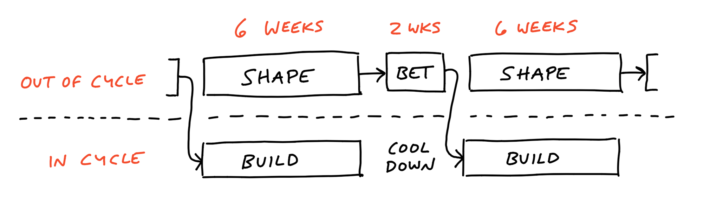

Esse post faz parte de uma série de posts sobre a metodologia Shape Up da Basecamp. Nesse post, vamos falar sobre o que é Shape Up e um panorama geral sobre o processo. No próximo post, vamos focar em como cada etapa do processo funciona na prática.

Em termos gerais, Shape Up é um framework criado pela Basecamp que busca resolver os desafios comuns que times de desenvolvimento de produto enfrentam ([leia mais aqui](https://basecamp.com/shapeup/0.3-chapter-01#growing-pains)). Essa metodologia promete ajudar as equipes a se organizar melhor e modelar os problemas com antecedência, construir e entregar soluções dentro de um período fixo de tempo, com maior eficiência e geração de valor para o negócio. É ideal para empresas menores porque equilibra a necessidade de processos estruturados com a flexibilidade de se adaptar rapidamente. Também minimiza o escopo excessivo e garante que a equipe se concentre em tarefas de alta prioridade.

## Porque Shape Up

- Balanço entre autonomia e responsabilidade.
- Garante trabalho focado e entrega de valor para o negócio.
- Reduz riscos

## Processo

No Shape-up todo problema é refinado previamente pela tríade (PM+TL+PD) antes de entrar em desenvolvimento. O processo todo divide a força de trabalho em dois grupos principais:

- `Tríade`
Atua no que está fora do ciclo (também conhecido como Upstream)

- `Time dev`
Atua no que está dentro do ciclo (também conhecido como Downstream)

## Fora do ciclo

`Shape`

Processo de 6 semanas de refinamento de um problema, realizado pela tríade (TL+PM+PD), podendo consultar pessoas específicas de forma pontual (Staff ou alguém que tenha mais contexto sobre um determinado assunto), durante esse momento, a tríade explora o problema a fundo e documenta todo contexto, como métricas, fluxos, protótipos, etc. A ideia aqui é que o problema seja modelado previamente para que o time tenha autonomia e consiga atuar na solução em questão, se um Pitch passa por um bom processo de shaping (isto é, um bom refinamento), mais autônomo o time se torna. Se o time é mais autônomo, a tríade tem mais autonomia para refinar melhor os próximos Pitches, é um ciclo vicioso que propõe autonomia para ambas as partes. O inverso também é verdadeiro, você já entendeu a lógica né?

Vale ressaltar que a quantidade de contexto em um Pitch pode variar por diversos motivos: complexidade do assunto (negócio), complexidade técnica e maturidade do time.

> Acontece em paralelo com o ciclo de BUILD

`Betting Table`

É basicamente uma reunião com stakeholders de “mesa de apostas” onde a tríade apresenta o Pitch (problema, solução e apetite) e os stakeholders decidem se faz sentido priorizar nesse Pitch no próximo ciclo de BUILD ou não. A ideia aqui é sair com uma lista priorizada de Pitches a ser atuado pelo time dev na fase de BUILD.

> Acontece depois das 6 semanas de SHAPE

## Dentro do ciclo

`Build`

Processo de 6 semanas de construção da solução de um problema (problema este que já passou por shaping/refinamento e foi priorizado no betting table), realizado pelo time de desenvolvimento. Durante esse período o foco do time é 100% ajustado para construir, testar e implantar, dentro do **APETITE** definido uma solução para o problema, ou seja, se o Pitch possui um apetite de 6 semanas, esse é todo o tempo que o time tem para concluir o projeto.

> Acontece em paralelo com o ciclo de SHAPE

`Cool Down`

A etapa de Cool Down é uma pausa bem-vinda de 2 semanas ao final do ciclo de 6 semanas de building. É o momento apropriado para o time poder respirar, revisar o que foi feito durante último ciclo e, claro, se planejar para o que vem a seguir.
